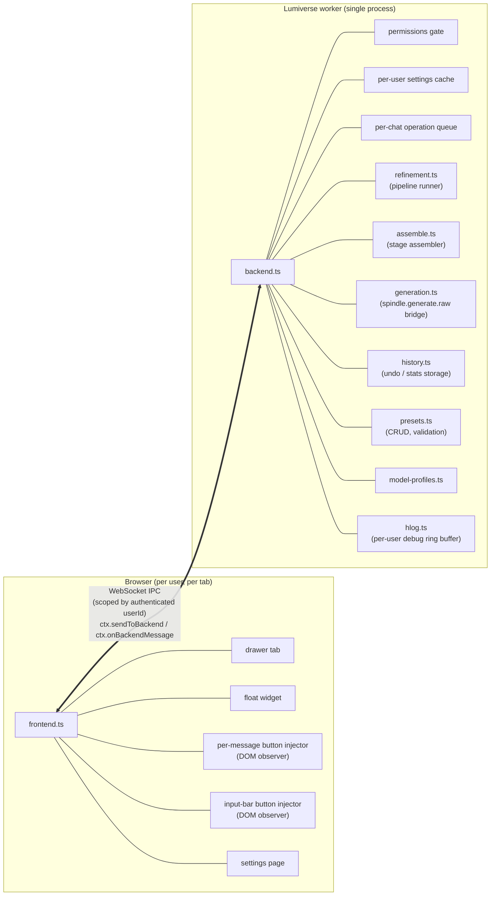

# Architecture

Hone is a backend-first Lumiverse extension. Most of the interesting logic runs in the Bun worker backend: assembly, macro resolution, LLM calls, undo storage, stats, state snapshotting. The frontend is a pure UI mirror. It sends IPC messages on user actions and renders whatever the backend pushes back.

This page walks the full event flow, the state model, the reliability guarantees, and why things are the way they are.

## Runtime shape



Backend-side externals: storage via `spindle.userStorage` (isolated per `userId`), generation via `spindle.generate.raw`, chat I/O via `spindle.chat` / `spindle.chats`, and event subscriptions via `spindle.on("GENERATION_STARTED/STOPPED/ENDED/MESSAGE_SWIPED/...")`.

One backend process, many users. Every IPC handler receives the authenticated `userId` from the WebSocket session and scopes all storage reads/writes to it. No cross-user leakage is structurally possible.

See [[Multi-User and Privacy]] for the isolation story.

## Event flow: refining one message

### Lifecycle

```mermaid
flowchart LR
    U(["User click<br/>(per-message button)"]) --> FE["Frontend sends<br/><code>{ type: 'refine', messageId, chatId }</code>"]
    FE --> PG["backend.ts IPC handler<br/><code>requirePermission('chat_mutation')</code>"]
    PG --> RS["refineSingle<br/>(chatId, messageId, userId, send)"]
    RS --> EQ["enqueueChatOperation<br/><code>${userId}:${chatId}</code>"]
    EQ --> SR["sendRefinedStateFor(userId)"]
    SR --> SS["snapshotLastAiState(userId, chatId)"]
    SS --> AC["send <code>{ type: 'active-chat', … }</code>"]
    AC --> FM["Frontend surfaces<br/>mirror snapshot"]
```



`snapshotLastAiState` does `getMessages(chatId)` + `listRefinedKeysInChat(userId, chatId)` (single index read), then finds the last assistant message, checks refined, and loads stages if refined. The pushed `active-chat` payload carries `chatId`, `lastMessageRefined`, `lastAiMessageId`, `lastAiStages`, and `refinedMessageIds`.

Frontend mirrors:

- `drawerTab.handleBackendMessage`: updates the Hone Control section.
- `messageInjector.setRefinedMessages(refinedMessageIds)`: flips per-message icons.
- `floatWidget` reads `lastMessageRefined` for hone/undo mood.
- `inputAreaInjector` rescans (in case the DOM changed).

### Inside the queued operation

The body of `enqueueChatOperation` runs serially per chat (see [Concurrency](#concurrency) below):

1. `getSettings(userId)`: cached after first read.
2. `send({ type: "refine-started", messageId })`.
3. `buildContext(chatId, messageId, userId, settings)`: fetches chat messages, character, lore, POV; builds `{{context}}`, `{{latest}}`, `{{userMessage}}`, `{{lore}}`, `{{pov}}`.
4. Capture `startSwipeId`, `startContent` for the race guard.
5. `minCharThreshold` check: skip if too short.
6. `resolveModel(settings, userId)`: loads active `ModelProfile`.
7. Load active preset (output or input, based on message role).
8. `runStrategy({ preset, settings, model, ... })`: see the per-stage diagram below.
9. Race guard: re-read the message; abort if `fresh.swipe_id !== startSwipeId`, if `fresh.content !== startContent`, or if the message is gone.
10. `saveUndo(userId, chatId, messageId, swipeId, entry)`: write per-message file + update FIFO index; evict if over 200.
11. `updateMessage(chatId, messageId, { content, metadata: { hone_refined: true } })`. On failure: rollback via `deleteUndo` (best-effort).
12. `autoShowDiff ? send({ type: "diff", original, refined })`.
13. `send({ type: "refine-complete", messageId, success: true })`.
14. Best-effort: `incrementStats(userId, chatId, strategy)`.

### runStrategy and per-stage execution

```mermaid
flowchart LR
    RS["runStrategy"] --> BR{strategy?}
    BR -->|sequential| SEQ["runPipeline<br/>(stages, …, emitStages=true)"]
    BR -->|parallel| PA["Promise.allSettled<br/>(proposals), concurrent"]
    PA --> AG["runPipeline<br/>(aggregator, …, proposals=[…], emitStages=true)"]
    SEQ --> PS
    AG --> PS

    subgraph PS["per stage"]
        direction LR
        A1["assembleStage<br/>(stage, prompts,<br/>headCollection, ctx)"] --> A2["Resolve per-stage<br/>ModelProfile<br/>(or inherit)"]
        A2 --> A3["buildGenerationParameters<br/>+ injectReasoningParams"]
        A3 --> A4["generate(req, userId)<br/>spindle.generate.raw<br/>with timeout race"]
        A4 --> A5["stripCoTTags (if enabled)<br/>+ parseTaggedBlock('OUTPUT')"]
        A5 --> A6["Emit <code>stage-complete</code><br/>(progressive rendering)"]
        A6 --> A7["Thread output into<br/><code>{{latest}}</code>"]
    end
```



`assembleStage` expands `__head__` refs, concatenates row prompts with `\n\n`, then runs the three substitution phases described under [Assembly](#assembly).

## State model

### The backend is the source of truth

The frontend never stores authoritative state.

After every state change (refine, undo, swipe nav, swipe delete, permission change), the backend pushes a fresh `active-chat` snapshot:

```typescript
{
  type: "active-chat",
  chatId: string | null,
  lastMessageRefined: boolean,
  lastAiMessageId: string | null,
  lastAiStages: StageRecord[] | undefined,
  refinedMessageIds: string[]   // per-current-swipe list
}
```

Every frontend surface mirrors this snapshot directly:

- `messageInjector.setRefinedMessages(refinedMessageIds)`. Per-message button icons.
- `drawerTab.handleBackendMessage({ type: "active-chat", ... })`. Hone Control section plus stage picker.
- `floatWidget.handleBackendMessage({ type: "active-chat", ... })`. Refined flag drives hover chibi.

No surface derives refined/unrefined state or event types.

### Per-current-swipe computation

`snapshotLastAiState` uses one index read to answer "which (messageId, swipeId) pairs have undo entries in this chat?". `listRefinedKeysInChat` reads `undo/<chatId>/_index.json` once and returns a `Set<"messageId:swipeId">`. Then it scans the chat's assistant messages and includes any whose `(id, swipe_id)` key is in the set.

No per-message file reads for the snapshot. Only the last assistant message's full undo entry is loaded (for stage records).

## Concurrency

### Per-chat operation queue

`enqueueChatOperation(chatId, fn)` serializes read-modify-write flows on the same chat. Only refineSingle and the swipe-deletion handler use it. Writes within a single operation don't interleave with each other.

```typescript
const chatQueues = new Map<string, Promise<void>>();

export function enqueueChatOperation(chatId, fn) {
  const prev = chatQueues.get(chatId) || Promise.resolve();
  const next = prev.then(fn, fn).finally(() => {
    if (chatQueues.get(chatId) === next) chatQueues.delete(chatId);
  });
  chatQueues.set(chatId, next);
  return next;
}
```

Operations on different chats run concurrently. Operations on the same chat run serially. So:

- Rapid-fire Hone clicks on different messages in the same chat queue up in order.
- Hone while auto-refine fires for a different chat: both run in parallel.
- Concurrent refine plus swipe-delete on the same chat: serialised through the queue, can't corrupt each other.

The queue key is `${userId}:${chatId}`. Per-user-per-chat. Different users' operations on the "same" chat id would never actually collide (chat ids are unique), but the key structure makes the isolation explicit.

### Per-user state

- `cacheByUser`. Settings cache, keyed by userId.
- `activeGenerationsByUser`. In-flight generation ids for the `generating` flag.
- `buffers` (hlog). Per-user debug ring buffers.
- Every storage call is scoped: `spindle.userStorage.getJson(path, { userId })`.

## Assembly

`assembleStage(stage, prompts, headCollection, ctx)` in [src/assemble.ts](../src/assemble.ts) is the single boundary between "preset config" and "messages array sent to the LLM." Used by live refinement and by the preview modal.

### Three phases

Phase 1: local macros, synchronous. For each row:

1. Expand `__head__` sentinels to the Head Collection's prompt ids.
2. Look up each prompt's `content`.
3. Concat with `\n\n` between chunks. Empty prompts drop.
4. Substitute Hone-local macros (`{{message}}`, `{{latest}}`, `{{context}}`, etc.) via a single regex pass. Unknown macros stay as `{{...}}` for phase 2.

Phase 2: Lumiverse macros, async per row. For each phase-1 row that still contains `{{...}}`:

1. Call `spindle.macros.resolve(content, { chatId, characterId, userId })`.
2. Collect `diagnostics` for unresolved macros.

Phase 3: merge adjacent same-role rows. Runs after phase 2 so the merge sees resolved text. Empty rows drop.

The result is an `{ role, content }[]` array ready for `spindle.generate.raw`.

### Why two substitution phases

Hone-local macros are cheap, synchronous, and specific to one pipeline. Lumiverse's macro resolver is per-chat/per-user/async and can hit real data (character cards, persona, variables). Doing Hone-local first means we don't ship partial macro strings to Lumiverse for resolution. Doing Lumiverse second means we don't have to re-implement Lumiverse's whole macro catalogue.

## Reliability

It's reliable I promise.

## Data layout

Per-user storage under `spindle.userStorage`:

```text
settings.json                                # HoneSettings (per-user)

presets/<id>.json                            # custom presets (HonePreset JSON)

model-profiles/<id>.json                     # model profiles (ModelProfile JSON)

undo/<chatId>/<messageId>.json               # UndoEntry per swipeId
undo/<chatId>/_index.json                    # FIFO queue for eviction

stats/<chatId>.json                          # per-chat ChatStats
```

Built-in presets are bundled into the backend as TypeScript imports. Never written to disk.

Debug log buffers are in-memory only. Lost on extension reload. By design. Disk logs invite cross-user leaks.

## Generation bridge

`generate(req, userId)` in [src/generation.ts](../src/generation.ts) wraps `spindle.generate.raw`:

1. Resolve the connection id to `{ id, model }`. Direct `connections.get(id)` when a specific id is requested. List plus find-default fallback when empty.
2. Build parameters (samplers plus reasoning injection).
3. Race `spindle.generate.raw({...})` against a timeout Promise.
4. Return `{ content, success, error? }`.

No retry logic. A transient provider error surfaces as `success: false` and the stage fails loudly. Manual retry is one click.

## Event subscriptions

The backend subscribes to these Lumiverse events:

| Event | Handler | Purpose |
| --- | --- | --- |
| `GENERATION_STARTED` | Track in `activeGenerationsByUser`, push `generation-state` | Disable input-bar Hone during main chat generation |
| `GENERATION_STOPPED` | Remove from tracking, push `generation-state` | Re-enable input-bar Hone |
| `GENERATION_ENDED` | Same plus fire auto-refine if enabled and assistant-role | Main path for auto-refine |
| `MESSAGE_SWIPED` | On `deleted`: reconcile undo storage. Always: `sendRefinedStateFor` | Per-swipe undo integrity |

`MESSAGE_EDITED` is intentionally not subscribed. Edits must preserve undo so the user can still undo after manually tweaking a refined message. The refine path re-reads before write so our own `updateMessage` calls don't self-loop-race.

`CHAT_CHANGED` is intentionally not subscribed. It fires only on metadata updates (title, favorite, avatar, re-attribution), never changes refined state. Chat switching is detected via `SETTINGS_UPDATED(activeChatId)` on the frontend, which triggers a fresh `get-active-chat` IPC.

## Build artifacts

```text
dist/backend.js     bundled via `bun build --target bun`
dist/frontend.js    bundled via `bun build --target browser`
```

Assets (chibi sprites, bundled ding.mp3) are inlined at build time via `scripts/gen-asset-modules.ts`. The frontend bundle carries them as data URLs. No runtime static-asset HTTP.

## Next

- [[Multi-User and Privacy]]. Isolation details plus debug log story.
- [[Undo and Diffs]]. Rollback plus race guards in depth.
- [[Known Limitations]]. What's blocked on Spindle additions.
