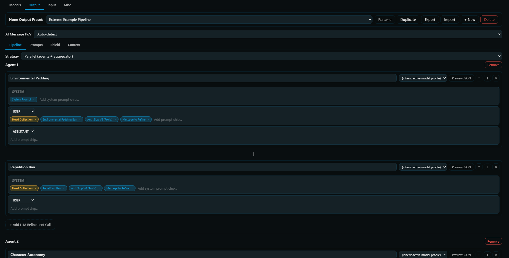
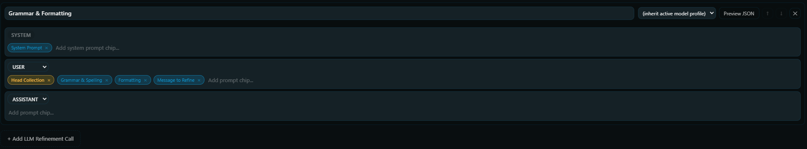
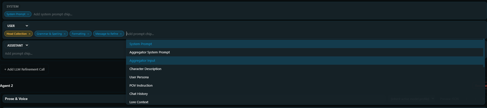
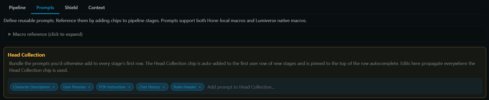

# Pipeline Editor

The pipeline editor is where most customization happens. It lives under Output -> Pipeline or Input -> Pipeline. The same editor shows up in three places: as the whole pipeline for sequential presets, as each proposal in a parallel preset, and as the aggregator in a parallel preset.

All three render the same way. A vertical stack of stages separated by arrows, with an "Add LLM Refinement Call" button at the bottom.

## Stages

A stage is one LLM call. Each stage card has a header and some rows.

### Header

- Stage name (text input). Free-form. Shown in the stage picker after refinement. Use something descriptive: `Grammar & Formatting`, `Prose & Voice`, `Lore Consistency Pass`.
- Model profile override (dropdown). `(inherit active model profile)` by default. Pick a specific profile to run *just this stage* on a different model. See [[Model Profiles#per-stage-overrides]].
- Preview JSON button. Shows the messages array that would be sent to the LLM if you Honed right now.
  - If you have a chat open when you click Preview, macros resolve against the real chat state. Otherwise will show placeholders.
- Up / Down buttons (`↑` / `↓`). Reorder stages.
- Delete (`✕`). Removes the stage. No confirmation.

### Rows

Below the header, a stack of message rows. Each row has a role (system, user, assistant) and a chip input for adding prompts.

- The first row is always system-locked.
- Subsequent rows pick user or assistant via the role dropdown.

### Staging row

Every stage always has a trailing empty staging row at the bottom. Add a chip to it and a new staging row spawns below. Empty middle rows collapse automatically. The last row never does.

### Adjacent same-role warning

If two adjacent rows both have non-empty chip lists and the same role, a yellow warning banner appears between them. This is a heads-up: those two rows will be merged into a single message when the LLM is called. Usually that's what you want (it lets you split a long user prompt into editable chunks). The warning just makes the merge visible.

## Chips

A chip is a reference to a prompt in the preset's library. Chips render as pills inside a row's chip input.

### Adding a chip

Click the row's chip input ("Add prompt chip..." placeholder). Start typing. A suggestion popup shows filtered matches:

- Arrow keys navigate.
- Enter selects the highlighted suggestion.
- Clicking a suggestion adds it as a chip.

### Special: the Head Collection meta-chip

When the preset has a non-empty Head Collection, a pinned "Head Collection" suggestion appears at the top of every chip popup. Selecting it adds the meta-chip, a single orange-tinted pill that stands in for *all* the prompts listed in the Head Collection.

New stages auto-seed their first user row with a Head Collection chip (if the preset has one). You can remove or reorder it like any other chip.

### Removing a chip

Click the `×` on the chip, or press Backspace with the chip input focused and empty.

### Reordering chips

- Desktop: drag a chip to a different position in the same row.
- Mobile: long-press a chip to start dragging.

Cross-row chip drag isn't supported. To move a chip between rows, delete and re-add.

### Missing-prompt chip

If you delete a prompt from the library that a chip references, the chip renders red with `<missing: id>`. At refinement time, missing prompts are silently dropped from the row.

## Head Collection

The Head Collection is a reusable bundle of prompts that's typically the "context preamble" for every stage: character card, persona, POV, chat history, rules header. Instead of copy-pasting those 5 chips into every stage's first user row, you put them in the Head Collection once and drop a single meta-chip into each stage.

### Edit the Head Collection

Prompts sub-subtab, then the orange-bordered "Head Collection" card at the top. Add, remove, reorder prompts. Every stage that uses the meta-chip reflects the change at the next refine.

### Why bother?

- Less duplication. Adding a new context block only means updating one place.
- Consistent preambles. Every stage starts with the same context structure. No risk of forgetting a chip in one stage.
- Clean pipelines. A 7-stage pipeline with Head Collection has 7 meta-chips plus 7 stage-specific rule bundles, instead of 7 copies of the 5 preamble chips.

## Stage order and `{{latest}}`

For sequential pipelines, `{{latest}}` threads through stages:

- Stage 1's `{{latest}}` is the original AI message.
- Stage 2's `{{latest}}` is stage 1's refined output.
- And so on.

Put stages in order from "foundation fixes" (grammar, formatting) to "style polish" to "high-level coherence." Each later stage looks at a cleaned-up version of the last stage's work.

For parallel pipelines, every proposal sees the *original* as `{{latest}}` (proposals are alternatives, not a progression). The aggregator also starts from the original. Proposal outputs are available to the aggregator via `{{proposal_N}}` macros.

## What the LLM has to output

Hone expects the model's response to contain an `<HONE-OUTPUT>...</HONE-OUTPUT>` block. The text inside those tags is what gets written back to the chat. Everything outside is discarded (including `<HONE-NOTES>` changelog blocks the built-in presets request).

If the model returns `<think>` / `<thinking>` / `<reasoning>` tags and "Strip Reasoning Tags" is on in the active model profile (default on), those tags are stripped before extraction.

If the model returns a partial or malformed response, Hone recovers where it can (unclosed `<HONE-OUTPUT>`, stray `<HONE-NOTES>` blocks; see [[Prompts and Macros#hone-output-and-hone-notes-tags]]) and fails loudly otherwise with a *Hone Error* modal. The message isn't overwritten on failure. You don't want reasoning text or apology messages getting inserted into your chat.

## Next

- [[Prompts and Macros]]. Authoring prompts, full macro list.
- [[Strategies]]. Sequential vs. parallel mechanics.
- [[Model Profiles]]. What you override when you set a stage's profile.
