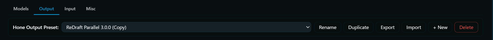

# Presets

A preset is the self-contained configuration of *how* one refinement happens. It bundles the prompt library, the pipeline shape, and (optionally) per-stage model overrides. Everything else (which LLM to call, context token budgets, POV mode, automation toggles) is global Hone setting. The preset controls the *prompting* and *structure* only.

## Output vs. Input

Presets come in two types.

| Slot   | Drives                                                             | Macro details                                                                           |
| ------ | ------------------------------------------------------------------ | --------------------------------------------------------------------------------------- |
| Output | AI-message refinement (pencil on bubbles, Hone Last, float widget) | `{{latest}}` is the AI message being refined. `{{userMessage}}` is empty.           |
| Input  | User-draft enhancement (input-bar Hone button)                     | `{{latest}}` is the last AI message in chat. `{{userMessage}}` is the user's draft. |

Built-in presets are slot-specific. Custom presets carry whatever slot you saved them under.

The output preset and input preset are tracked separately. Switching one has no effect on the other.

## Built-in catalog

Hone ships 11 built-in presets. They live inside the repo and are never written to disk. They can't be edited directly. Click Duplicate in the preset bar to create an editable copy.

All built-in prompt text descends from [ReDraft](https://github.com/MeowCatboyMeow/ReDraft) by MeowCatboyMeow and is licensed under CC BY-NC-SA 4.0 (see [[License and Credits]]).

*Note: Every built-in output preset shields scaffolding mechanically: block-level HTML-ish tags, fenced code, and bracket/brace blocks on their own line are swapped for `<HONE-SHIELD-N/>` tokens before the LLM call and restored afterwards. The system prompts also reference `{{shield_preservation_note}}` so the model is given the exact tokens to preserve. See [[Prompts and Macros#shielding-literal-blocks]].*

### Output presets (for AI messages)

| Preset | Strategy | Stages | Use when |
| --- | --- | --- | --- |
| ReDraft Default 3.0.0 | Pipeline | 1 (`Refine`) | You want a single fast pass with the ReDraft rule set in one LLM call. |
| ReDraft Default 3.0.0 Lite | Pipeline | 1 (`Refine`) | Same rules as ReDraft Default, but the model skips the `<HONE-NOTES>` changelog and goes straight to `<HONE-OUTPUT>`. Faster, no thinking pass. May be less effective on models that benefit from verbalizing their reasoning. |
| ReDraft 3-Step 3.0.0 | Pipeline | 3 (`Grammar & Formatting`, `Prose & Voice`, `Continuity & Flow`) | You want rule groups to execute serially so each pass can focus on one axis. Higher token cost, often cleaner output. |
| ReDraft Parallel 3.0.0 | Parallel | 3 proposals + 1 aggregator | Multiple agents with different rule emphases run concurrently, then an aggregator picks the strongest result. |
| Simulacra v4 1.0 | Pipeline | 1 | **Default on install.** Simulacra's rule set (more opinionated than ReDraft), single pass. |
| Simulacra v4 1.0 Lite | Pipeline | 1 | Same rules as Simulacra v4, but the model skips the `<HONE-NOTES>` changelog and goes straight to `<HONE-OUTPUT>`. Faster, no thinking pass. May be less effective on models that benefit from verbalizing their reasoning. |
| Simulacra v4 3-Step 1.0 | Pipeline | 3 | Simulacra's rule set, multi-stage. |
| Simulacra v4 Parallel 1.0 | Parallel | 3 proposals + 1 aggregator | Simulacra's rule set, parallel. |
| Extreme Example | Pipeline | 3 | Demonstration preset showing aggressive rewrites and all the knobs as reference. Do not use this! |

### Input presets (for user drafts)

| Preset                | Strategy | Stages                                          | Use when                                                   |
| --------------------- | -------- | ----------------------------------------------- | ---------------------------------------------------------- |
| Input Single Pass 1.0 | Pipeline | 1 (`Enhance`)                                 | Default for draft enhancement. Single call, persona-aware. |
| Input Multi Stage 1.0 | Pipeline | 2 (`Grammar & Formatting`, `Voice & Prose`) | More thorough draft polish at 2× the token cost.          |

*Note: Both input presets handle empty box impersonation Their system prompt includes an "if the message is empty, impersonate the persona and write a short in-persona reply" clause. Click Hone on an empty compose box to see this in action.*

## Importing a shared preset

Click import button. Switch to preset. Boom.

## Exporting a preset

Switch to preset. Click export button. Boom.

*Note: Per-stage model overrides are stripped on export.*

## Creating / editing a custom preset

Every change in the drawer's Output/Input editor saves automatically. There's no Save button.

### 1. Duplicate a built-in

Preset bar, Duplicate. The copy becomes active immediately and the name input appears in the bar. Rename it to something memorable.

### 2. Edit the prompt library (Prompts tab)

See [[Prompts and Macros#the-prompt-library]] for more.

### 3. Edit the Head Collection

See [[Pipeline Editor#head-collection]] for more.

### 4. Edit the pipeline (Pipeline tab)

See [[Pipeline Editor]] for instructions.

### 5. Tune shielding (Shield tab, output presets only)

Toggle the master switch, edit include/exclude regex patterns, or reset to defaults. See [[Prompts and Macros#shielding-literal-blocks]] for how shielding fits into the refine pipeline.

## Next

- [[Pipeline Editor]]. The stage/row/chip editor.
- [[Prompts and Macros]]. Prompt authoring and the full macro reference.
- [[Strategies]]. Sequential vs. parallel.
