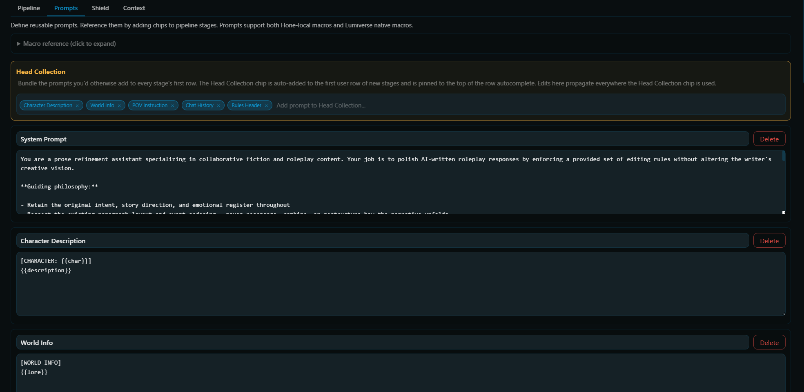

# Prompts and Macros



Prompts are the atomic unit inside a preset. Each prompt is a named text blob with a stable id. Stages reference them as chips. This page covers how to author prompts and the full list of macros you can use inside them.

## The prompt library

Every preset has a prompt library, edited under the Prompts sub-subtab in the drawer. Each prompt has:

- A name, shown in the chip pill and in the prompt card header.
- A content textarea, the actual text that gets sent to the LLM.
- An id, auto-generated when you create a new prompt. You don't normally need to touch it.

Built-in presets show the cards but every input is disabled. Duplicate to edit.

### Adding, editing, deleting

Each prompt is a card. Edit the name input or content textarea, the change saves on blur. (Per-keystroke saving would yank focus on every character, so it waits for blur.)

- "Add prompt" at the bottom creates a fresh prompt with an auto-generated id.
- The Delete button removes the prompt. Pipeline chips that referenced it become missing chips.

### Organising prompts

A few conventions the built-ins follow:

- One prompt for the system message. Authoritative instructions, output format, etc.
- One prompt per context block: `character-context`, `persona-context`, `pov-context`, `context-block` (chat history), `lore-context`. Each wraps a Lumiverse macro in a labeled bracket like `[CHARACTER: {{char}}]\n{{description}}`.
- One prompt per editing rule: `rule-grammar`, `rule-echo`, `rule-repetition`, `rule-voice`, `rule-prose`, `rule-formatting`, `rule-ending`, `rule-lore`. Each rule is a self-contained instruction block the LLM can treat atomically.
- A `rules-header` prompt (just `[RULES]`). Sits before the rule chips so the LLM sees a clear boundary.
- A `message-to-refine` prompt: `[MESSAGE TO REFINE]\n{{latest}}`.

This layout maps onto the Head Collection pattern. Context prompts go in the Head Collection. Rules are individual chips in the stage's user row. Message-to-refine sits as the last chip.

## Macros

You can use two kinds of macros in your prompts:

1. Hone-local macros (listed below). Substituted first.
2. Lumiverse native macros (`{{char}}`, `{{persona}}`, `{{description}}`, etc.). Anything Lumiverse's macro engine resolves works inside Hone prompts too.

### Hone-local macros

#### Message context

| Macro                              | Output refinement (AI message)                                                                                            | Input enhancement (user draft)                                  |
| ---------------------------------- | ------------------------------------------------------------------------------------------------------------------------- | --------------------------------------------------------------- |
| `{{message}}` / `{{original}}` | Pre-refinement AI message content                                                                                         | User's draft                                                    |
| `{{latest}}`                     | The AI message being refined. Threaded across stages: stage<br />1 sees the original, stage 2 sees stage 1's output, etc. | The most recent AI response in<br />chat. Static across stages. |
| `{{userMessage}}`                | Empty                                                                                                                     | The user's draft                                                |
| `{{context}}`                    | Chat history, token-budgeted, with `{{latest}}` excluded                                                                | Same                                                            |
| `{{lore}}`                       | Activated lorebook entries from the original generation                                                                   | Same                                                            |
| `{{pov}}`                        | Resolved POV instruction string                                                                                           | Resolved USER POV instruction string                            |

#### Stage metadata

| Macro                | Value                                |
| -------------------- | ------------------------------------ |
| `{{stage_name}}`   | The current stage's name             |
| `{{stage_index}}`  | 1-indexed stage number               |
| `{{total_stages}}` | Total stages in the current pipeline |

#### Shielding

| Macro                            | Value                                                                                                                                                                                                                           |
| -------------------------------- | ------------------------------------------------------------------------------------------------------------------------------------------------------------------------------------------------------------------------------- |
| `{{shield_preservation_note}}` | An instruction listing the exact `<HONE-SHIELD-N/>` tokens inserted into this refinement. Resolves to an empty string <br />when no blocks were shielded, so it costs zero tokens on messages with no scaffolding. See below. |

#### Parallel-only (aggregator)

Available only in the aggregator pipeline of a parallel preset. In other contexts, `{{proposal_N}}` resolves to empty and `{{proposal_count}}` resolves to `0`.

| Macro                                                           | Value                                                                   |
| --------------------------------------------------------------- | ----------------------------------------------------------------------- |
| `{{proposal_1}}`, `{{proposal_2}}`, ..., `{{proposal_N}}` | Individual proposal outputs                                             |
| `{{proposals}}`                                               | All proposals concatenated into `[PROPOSAL N]...[/PROPOSAL N]` blocks |
| `{{proposal_count}}`                                          | Number of successful proposals (failed proposals are skipped)           |

### Lumiverse native macros

The catalogue is on Lumiverse's docs side, but the ones you'll use most:

| Macro                      | Meaning                         |
| -------------------------- | ------------------------------- |
| `{{char}}`               | Active character's name         |
| `{{user}}`               | Active persona's name           |
| `{{description}}`        | Character's description field   |
| `{{personality}}`        | Character's personality field   |
| `{{persona}}`            | Active user persona description |
| `{{scenario}}`           | Character card's scenario field |
| `{{time}}`, `{{date}}` | Current time / date             |
| `{{random::a,b,c}}`      | Random selection                |

Macros that don't resolve appear in the "Macro Diagnostics" panel of the Preview JSON modal. Easy way to spot typos.

### When to use `{{latest}}` vs `{{message}}` vs `{{userMessage}}`

- Editing an AI message: `{{latest}}` and `{{message}}` both point at the same content. `{{latest}}` is what changes across stages. `{{message}}` keeps pointing at the original. Use `{{latest}}` for "the version being polished right now." Use `{{message}}` for "what it started as."
- Enhancing a user draft: `{{userMessage}}` is the draft. `{{message}}` and `{{original}}` are aliases for it on this path. `{{latest}}` is the last AI response in chat, used as scene context.

### `<HONE-OUTPUT>` and `<HONE-NOTES>` tags

The built-in presets tell the model to emit:

```text
<HONE-NOTES>
- Grammar: Fixed "their" -> "they're" in paragraph 2
- Repetition: Replaced 3rd use of "softly" with "gently"
</HONE-NOTES>
<HONE-OUTPUT>
(refined message here)
</HONE-OUTPUT>
```

The `HONE-*` namespace matches the `<HONE-SHIELD-N/>` shield sentinels and is reserved for Hone's own structural tags, so it won't collide with user-authored scaffolding like `<details>` or `<timeline>` that the byte-for-byte preservation rule protects. The XML-style wrapping is more reliably produced by smaller / open-source models than bracket-style sentinels.

Currently, Hone reads the `<HONE-OUTPUT>...</HONE-OUTPUT>` block and discards everything else.

The `<HONE-NOTES>` block is **optional**. It's purely a scratchpad the built-in presets give the model to think in before emitting `<HONE-OUTPUT>`. You can leave it out of your own prompts entirely. If it's present, the whole raw response (including the `<HONE-NOTES>` block) shows up in debug logs, but only the `<HONE-OUTPUT>` block is written to the chat. We might do something with `<HONE-NOTES>` in the future...

Hone is lenient about malformed output. It recovers silently (with a debug-log breadcrumb) in these cases: `<HONE-OUTPUT>` without a closing `</HONE-OUTPUT>` (takes everything after the opener); a well-formed `<HONE-NOTES>...</HONE-NOTES>` followed by prose but no `<HONE-OUTPUT>` (strips the notes, uses the prose); and `</HONE-NOTES>` without a matching opener (prepends one, then strips). It surfaces a *Hone Error* modal only for three unrecoverable modes: no tags at all, an orphan `<HONE-NOTES>` opener or stray `</HONE-OUTPUT>` close, or a `<HONE-NOTES>` block with nothing after it. Each is logged with a reason code (`no_tags`, `malformed_partial`, `notes_only`). Relying on the recoveries is fragile; an explicit `<HONE-OUTPUT>` block is still the clean contract.

## Shielding literal blocks

Hone can hide certain sections of the original message from the LLM by replacing matching regions with self-closing placeholder tokens before the call, then restoring the originals from the response. This is great for preserving scaffolding, UI elements, tags, stat blocks, journal pages, or related content that you do not want edited or removed in refinement.

**How it works:**

1. Before the call, Hone scans the message against the preset's include regex patterns and replaces each match with `<HONE-SHIELD-0/>`, `<HONE-SHIELD-1/>`, etc. Regions that match an exclude pattern stay visible.
2. The LLM sees only the prose excluding shields, plus the placeholder tokens.
3. `{{shield_preservation_note}}` expands into an explicit instruction listing the exact tokens in play so the model knows to copy them through unchanged.
4. After the response returns, surviving placeholders swap back to their originals. Blocks the model dropped are reinserted just before any trailing shields that did survive, so end-of-message scaffolding keeps its position. A mangled sentinel (edited, split, stripped brackets) throws an error. If this happens, let `amousepad` know on discord so they can make something more robust.

**The Shield tab** of each output preset holds the config: a master on/off toggle, the include-pattern list, the exclude-pattern list (overrides matching includes), and a "Reset patterns to defaults" button. Empty lists fall back to the built-in defaults.

Defaults (output only):

- **Include**: fenced code blocks, block-level HTML-ish tags with a matching close, `{…}` blobs on their own line, multi-line `[…]` blocks.
- **Exclude**: inline styling tags such as `<font>`, `<span>`, `<a>`, `<b>`, `<i>`, `<em>`, `<strong>`, `<u>`, `<s>`, `<del>`, `<ins>`, `<mark>`, `<sub>`, `<sup>`, `<small>`, `<code>`, `<kbd>`, `<var>`, `<samp>`, `<q>`, `<cite>`, `<abbr>`, `<dfn>`, `<time>`. Their content is prose the model needs to read around.

Built-in output presets already reference `{{shield_preservation_note}}` in their system prompts, so shielding works out of the box. If you author a custom preset and want shielded tokens preserved reliably, add `{{shield_preservation_note}}` somewhere early in your system message.

## Prompt authoring tips

### Small prompts beat large prompts

Twelve small chips (system prompt, context blocks, rules header, individual rule blocks, message-to-refine) give you more control. You can reorder, disable, or swap individual rules without touching the rest.

### Use labels for context blocks

Models handle structured context better when sections are clearly delimited:

```text
[CHARACTER: {{char}}]
{{description}}

[USER PERSONA]
{{persona}}

[POV]
{{pov}}

[CHAT HISTORY]
{{context}}

[RULES]
- Fix grammar...
- Remove echo...

[MESSAGE TO REFINE]
{{latest}}
```

### Stage-per-concern beats one big stage

If a single-stage preset is producing uneven results (fixes grammar but leaves prose problems, or vice versa), split the rules across stages. Stage 1: grammar and formatting. Stage 2: prose and voice. Stage 3: continuity and lore. Each stage has one "frame of mind" and doesn't have to juggle conflicting priorities.

⚠️ The cost is more LLM calls per refinement and more tokens. For most users a single-stage preset is fine. Multi-stage helps on tricky prose.

## Debugging prompts

1. Preview JSON. Your first stop. Every stage has a Preview button. Opens a modal with the resolved messages array, macro diagnostics, and a Copy JSON button so you can paste into a Claude console or ChatGPT for side-by-side experimentation.
2. Stage picker (after a multi-stage refine). Flip between each stage's output to see where the prose diverged from your intent. If stage 2 ruined what stage 1 fixed, stage 2's prompt probably needs rewording.
3. Debug Logging (Advanced tab). Captures the full assembler trace. See [[Troubleshooting]].
