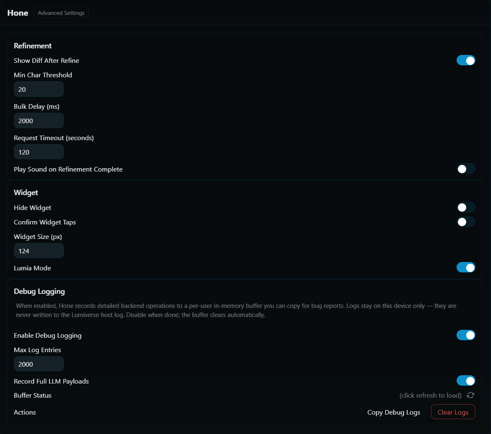

# Settings Reference

This page covers everything in the Advanced page.

All settings are per-user.

## Refinement section

| Setting                           | Default | Range    | Purpose                                                                                                                                                |
| --------------------------------- | ------- | -------- | ------------------------------------------------------------------------------------------------------------------------------------------------------ |
| Show Diff After Refine            | On      | -        | Show a word-level diff modal after every successful refinement. Turn off for silent background refinement (auto-refine pairs well with this off). |
| Min Char Threshold                | 20      | 0–500   | Skip refinement for messages shorter than this. Saves tokens on trivially smallmessages.                                                               |
| Bulk Delay (ms)                   | 2000    | 0–30000 | Milliseconds to wait between messages during "Hone All" runs. Keeps you from hitting rate limits on a 50-message chat.                            |
| Request Timeout (seconds)         | 120     | 30–600  | Per-LLM-call timeout. Applied to every stage. A 3-stage pipeline can take up to 3× this before the whole refine aborts.                          |
| Play Sound on Refinement Complete | Off     | -        | Audio cue when a refine finishes.                                                                                                                      |
| Custom Sound URL                  | `""`  | -        | Paste any URL to override the default sound. Visible only when Play Sound is on.                                                                       |

## Widget section

| Setting             | Default | Range    | Purpose                                                                                                       |
| ------------------- | ------- | -------- | ------------------------------------------------------------------------------------------------------------- |
| Hide Widget         | Off     | -        | Hide the floating chibi/icon widget entirely. Drawer plus per-message button still work.                      |
| Confirm Widget Taps | Off     | -        | Require a second tap within 4 seconds before the widget fires. Useful on mobile to avoid accidental triggers. |
| Widget Size (px)    | 48      | 24–1920 | Widget diameter. Also exposed via the widget's long-press / right-click context menu.                         |
| Lumia Mode          | On      | -        | Render the chibi character sprites. Off uses a classic circular icon pill.                                    |

## Debug Logging section

See [[Multi-User and Privacy]] for the privacy story.

| Setting                  | Default | Range       | Purpose                                                                             |
| ------------------------ | ------- | ----------- | ----------------------------------------------------------------------------------- |
| Enable Debug Logging     | Off     | -           | Start capturing per-user debug entries to an in-memory ring buffer. Off by default. |
| Max Log Entries          | 2000    | 100 - 20000 | Ring buffer capacity. Resizing preserves the most recent entries.                   |
| Record Full LLM Payloads | Off     | -           | Include text sent to and received by the LLM in debug logs when honing.             |

Plus two action buttons:

- Copy Debug Logs. Formats the buffer with timestamps and copies to clipboard. Paste into a bug report.
- Clear Logs. Empties the buffer without disabling capture.

A "Buffer Status" row shows current count, capacity, and whether logging is on.

## Drawer-tab settings (not on this page)

For completeness, settings that live elsewhere in the UI:

- Active output preset and active input preset. Drawer -> Output / Input preset bar.
- Active model profile. Drawer -> Models tab.
- Auto-Refine AI toggle. Drawer -> Hone tab -> Automation section.
- AI Message POV / User Message POV. Drawer -> Output / Input.
- Max Lorebook Tokens / Max Message History Tokens. Drawer -> Output (or Input) -> Context sub-subtab.

## Next

- [[Automation]]. Auto-refine and notification sound.
- [[Float Widget]]. Detailed behavior around the four widget settings.
- [[Multi-User and Privacy]]. The full story on debug logging.
