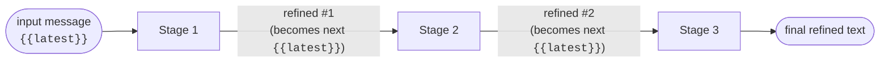
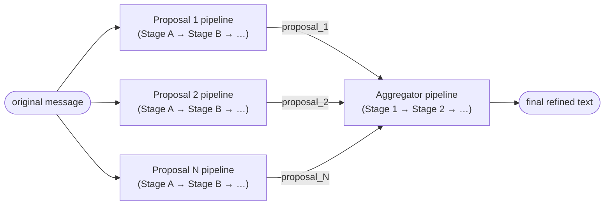

# Strategies: Sequential vs. Parallel

Every preset picks one of two strategies for how its pipeline runs.

- Sequential. Stages run one after another. Each stage's refined output becomes the next stage's `{{latest}}`.
- Parallel. N proposal pipelines run concurrently against the same original message. An aggregator pipeline then merges or picks among their outputs.

You pick the strategy in the preset's Pipeline sub-subtab via the Strategy dropdown: "Sequential" or "Parallel (agents + aggregator)". Switching preserves the prompt library and head collection. The pipeline structure gets rebuilt.

## Sequential

Each stage is one LLM call. The stage's assembled messages include all its chip content, with `{{latest}}` substituted to the previous stage's output (or the original for stage 1).

If any stage fails (LLM error, timeout, missing `<HONE-OUTPUT>` tag), the whole refinement aborts. The message isn't updated. The error modal names the failing stage.

### Stage picker

After a successful multi-stage refinement, the drawer shows:

- `Step 1: <stage 1 name>`
- `Step 2: <stage 2 name>`
- `Step 3: <stage 3 name>` (= the live content)

Click any of them to swap the message's content to that stage's output. The diff modal shows original vs. the picked stage. Flipping is instant.

## Parallel

Proposals run concurrently; the aggregator runs once they settle.

Every proposal is a full pipeline in its own right. Multiple stages, its own chips, its own Head Collection usage. Proposals run concurrently.

The aggregator is also a full pipeline. It can be one stage or several. The aggregator receives proposal outputs via:

- `{{proposal_1}}`, `{{proposal_2}}`, ..., `{{proposal_N}}`. Individual outputs.
- `{{proposals}}`. All outputs concatenated into `[PROPOSAL N]...[/PROPOSAL N]` blocks. Good for "pick the best from each" prompts.
- `{{proposal_count}}`. Number of successful proposals.

The aggregator's `{{latest}}` starts at the *original* message. Aggregator stages thread their own output forward normally. Aggregator can be faster than pure pipeline when there are more than 2 stages in the pipeline.

As long as at least one proposal succeeds, the aggregator runs. If the aggregator fails, the refinement is aborted. This behaviour may be changed in the future.

### Stage picker for parallel

The drawer shows a mixed set of buttons:

- `Agent 1: <proposal 1's last stage name>`. Final output of proposal 1.
- `Agent 2: <proposal 2's last stage name>`.
- `Agent N: ...`.
- `Step 1: <aggregator stage 1 name>`. First aggregator stage's output.
- `Step 2: ...`. Later aggregator stages if the aggregator is multi-stage.

Proposal buttons render before aggregator step buttons. Each button applies a distinct text. No two should ever resolve to the same content.

Proposal-internal stages (the stages *inside* one proposal) aren't surfaced. From your perspective, a proposal is one alternative candidate, not a progression. The intermediate stages within it would clutter the picker.

## Which should I pick?

- You've tuned a sequential preset and it's giving uneven results.
- You have budget for 3+ the LLM calls per refine.
- You want a proposal-judge style pipeline.

The built-in ReDraft Parallel and Simulacra v4 Parallel are starting points for parallel presets. Duplicate, tweak the individual proposal prompts to emphasize different rule groups.

## Next

- [[Pipeline Editor]]. The stage editor, including the parallel UI.
- [[Prompts and Macros]]. The full macro list, including the parallel-only macros.
